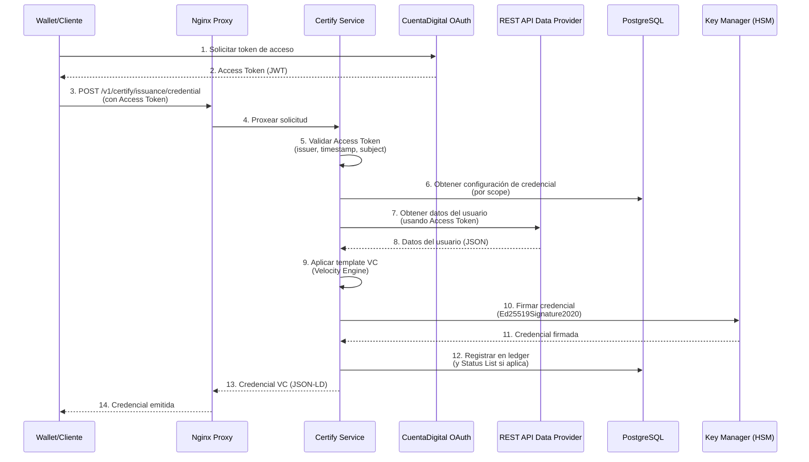

# Configuración de Certify para Emisión de Credenciales Verificables

## Tabla de Contenidos

1. [Introducción](#introducción)
2. [Base del Proyecto](#base-del-proyecto)
3. [Configuración de Propiedades](#configuración-de-propiedades)
4. [Base de Datos](#base-de-datos)
5. [Modificaciones al Código](#modificaciones-al-código)
6. [Docker Compose](#docker-compose)
7. [Build y Deployment](#build-y-deployment)
8. [Gestión de Configuraciones de Credenciales](#gestión-de-configuraciones-de-credenciales)
9. [Arquitectura de Servicios](#arquitectura-de-servicios)
10. [Consideraciones de Seguridad](#consideraciones-de-seguridad)

---

## Introducción

Este documento describe la configuración y personalización del módulo **Certify** para la emisión de credenciales verificables (Verifiable Credentials) siguiendo el estándar OpenID4VCI (OpenID for Verifiable Credential Issuance) draft 13. La implementación está basada en la versión **release/12.0.x** del repositorio [mosip/inji-certify](https://github.com/mosip/inji-certify) y ha sido adaptada para integrarse con **CuentaDigital** como proveedor de autenticación y autorización.

### Características Principales

- **Emisión de Credenciales Verificables**: Soporte para credenciales en formato JSON-LD (LDP_VC) con firma digital
- **Integración con CuentaDigital**: Autenticación y autorización mediante OAuth 2.0 / OpenID Connect
- **Soporte de Revocación**: Implementación de Status List 2021 para gestión de revocación de credenciales
- **Plugin de Data Provider**: Integración con API REST para obtener datos de credenciales
- **Firma Digital**: Uso de algoritmos Ed25519Signature2020 con EdDSA para firma de credenciales

---

## Base del Proyecto

### Repositorio y Versión

- **Repositorio Base**: https://github.com/mosip/inji-certify
- **Branch**: `release/12.0.x`
- **Versión del Servicio**: 0.12.2

### Estructura de Directorios Clave

```
inji-rd-certify/
├── docker-compose/
│   └── docker-compose-injistack/
│       ├── config/
│       │   ├── certify-default.properties      # Configuración general
│       │   └── certify-postgres-farmer.properties  # Configuración específica del caso de uso
│       ├── certify_init.sql                   # Script de inicialización de BD
│       ├── docker-compose.yaml                # Orquestación de servicios
│       └── certify-nginx.conf                 # Configuración del proxy reverso
├── certify-service/
│   ├── src/main/java/io/mosip/certify/
│   │   ├── filter/AccessTokenValidationFilter.java
│   │   ├── services/VCIssuanceServiceImpl.java
│   │   ├── services/CertifyIssuanceServiceImpl.java
│   │   └── utils/VCIssuanceUtil.java
│   └── Dockerfile                             # Imagen Docker personalizada
└── certify-core/                              # Módulo core del servicio
```

---

## Configuración de Propiedades

### Archivo: `certify-default.properties`

Este archivo contiene la configuración general del servicio Certify, incluyendo integración con CuentaDigital y parámetros de emisión de credenciales.

#### Configuración de DID (Decentralized Identifier)

```properties
# DID del emisor - Identificador descentralizado del issuer
mosip.certify.data-provider-plugin.did-url=did:web:<github_user>.github.io:<repo_name>:<repo_path>

# URI de la clave pública del emisor
mosip.certify.data-provider-plugin.issuer-public-key-uri=did:web:<github_user>.github.io:<repo_name>:<repo_path>#key-0

# Configuración del Key Manager para firma de credenciales
mosip.certify.data-provider-plugin.issuer.key-manager-app-id=CERTIFY_VC_SIGN_ED25519
mosip.certify.data-provider-plugin.issuer.key-manager-ref-id=ED25519_SIGN
```

**Nota**: Reemplazar `<github_user>`, `<repo_name>` y `<repo_path>` con los valores correspondientes a tu implementación.

#### Integración con Plugins

```properties
# Paquetes base para escaneo de integraciones
mosip.certify.integration.scan-base-package=io.mosip.certify.mock.integration,io.mosip.certify.restapidataprovider.integration

# URL base del API REST para obtener datos de credenciales
mosip.certify.data-provider-plugin.restapi.base-url=http://restapi:3000
mosip.certify.data-provider-plugin.restapi.auth-token=
```

#### Configuración de Autenticación con CuentaDigital

```properties
# URL del servidor de autorización (CuentaDigital)
mosip.certify.authorization.url=https://cuenta.digital.gob.do

# URI del emisor para validación de tokens JWT
mosip.certify.authn.issuer-uri=https://cuenta.digital.gob.do

# Endpoint JWK Set para validación de firma de tokens
mosip.certify.authn.jwk-set-uri=https://cuenta.digital.gob.do/.well-known/jwks.json

# Audiencias permitidas en los tokens de acceso
mosip.certify.authn.allowed-audiences={ 
    '${mosipbox.public.url}${server.servlet.path}/issuance/credential', 
    '${mosip.certify.authorization.url}/v1/esignet/vci/credential' 
}

# URL pública del servicio (usada para CORS y callbacks)
mosipbox.public.url=http://localhost:8090
```

**Justificación**: La configuración de audiencias permite que tokens emitidos por CuentaDigital sean aceptados tanto para el endpoint local de Certify como para el endpoint de eSignet, facilitando la interoperabilidad.

#### Configuración de Cache

```properties
# Tiempo de expiración del cache de plantillas (30 minutos)
mosip.certify.templatecache-expire-seconds=1800

# Tiempo de expiración del cache de datos de certificados (1 hora)
mosip.certify.certificatedatacache-expire-seconds=3600

# Configuración de expiración por tipo de cache
mosip.certify.cache.expire-in-seconds={
    'userinfo': ${mosip.certify.access-token-expire-seconds}, 
    'certificatedatacache': ${mosip.certify.certificatedatacache-expire-seconds} 
}
```

#### Configuración de Revocación (Versión 12.0.x)

```properties
# Suite criptográfica para firma de Status Lists
mosip.certify.status-list.signature-crypto-suite=Ed25519Signature2020

# Algoritmo de firma para Status Lists
mosip.certify.status-list.signature-algo=EdDSA

# Tamaño de la Status List en KB (16 KB = ~131,072 bits)
mosip.certify.statuslist.size-in-kb=16

# Propósitos soportados para el estado de credenciales
mosip.certify.data-provider-plugin.credential-status.supported-purposes={'revocation'}
```

**Explicación**: La Status List 2021 es un mecanismo estándar para gestionar la revocación de credenciales. Cada credencial puede tener un índice en una lista de estado, donde un bit indica si la credencial está revocada o no.

#### Configuración de Firma de Credenciales

```properties
# Algoritmo de firma para credenciales VC
mosip.certify.data-provider-plugin.issuer.vc-sign-algo=Ed25519Signature2020

# Información de visualización del emisor
mosip.certify.credential-config.issuer.display={
    {
        'name': 'Issuer Name',
        'locale': 'en'
    }
}
```

#### Configuración de Atributos Indexados

```properties
# Mapeo de atributos indexados para búsqueda en el ledger
# Permite extraer valores específicos de credenciales usando JSONPath
mosip.certify.indexed-mappings.national_id=$.national_id
```

**Uso**: Los atributos indexados permiten realizar búsquedas eficientes en el ledger de credenciales emitidas, facilitando operaciones como verificación de estado y auditoría.

### Archivo: `certify-postgres-farmer.properties`

Este archivo contiene la configuración específica para el caso de uso de emisión de credenciales de licencias de conducir (Driver License).

#### Configuración del Plugin REST API

```properties
# Mapeo de scopes a endpoints del API REST
mosip.certify.data-provider-plugin.restapi.scope-endpoint-mapping={
    'openid offline_access profile email': '/:national_id'
}

# Configuración de autenticación OAuth2 para el API REST
mosip.certify.data-provider-plugin.restapi.auth.token-url=https://cuenta.digital.gob.do/oauth2/token
mosip.certify.data-provider-plugin.restapi.auth.client-id=<client_id>
mosip.certify.data-provider-plugin.restapi.auth.client-secret=<client_secret>
```

**Funcionamiento**: Cuando se solicita una credencial con el scope `openid offline_access profile email`, el sistema realiza una llamada al endpoint `/:national_id` del API REST, reemplazando `:national_id` con el identificador nacional del usuario autenticado.

---

## Base de Datos

### Script de Inicialización: `certify_init.sql`

El script `certify_init.sql` inicializa la base de datos PostgreSQL con todas las tablas necesarias para el funcionamiento de Certify.

#### Tablas Principales

1. **`credential_config`**: Almacena las configuraciones de tipos de credenciales
   - Plantillas VC (vc_template)
   - Tipos de credenciales (credential_type)
   - Formatos soportados (credential_format)
   - Configuración de firma (signature_algo, signature_crypto_suite)
   - Metadatos de visualización (display, display_order)
   - Configuración de sujeto de credencial (credential_subject)

2. **`status_list_credential`**: Almacena las credenciales de Status List
   - Documento VC completo de la Status List
   - Propósito (revocation, suspension, etc.)
   - Capacidad y estado de la lista

3. **`ledger`**: Registro de todas las credenciales emitidas
   - ID de credencial
   - Emisor
   - Fechas de emisión y expiración
   - Atributos indexados para búsqueda
   - Detalles de estado de la credencial

4. **`credential_status_transaction`**: Historial de cambios de estado
   - Transacciones de revocación/suspensión
   - Índices en Status Lists
   - Propósitos de cambio de estado

5. **`status_list_available_indices`**: Gestión de índices disponibles
   - Control de asignación de índices en Status Lists
   - Optimización para búsqueda de índices libres

#### Inserción de Configuración Inicial

El script incluye un INSERT inicial para la configuración de "DriverLicense":

```sql
INSERT INTO certify.credential_config (
    credential_config_key_id,
    config_id,
    status,
    vc_template,
    -- ... otros campos
)
VALUES(
    'DriverLicense',
    gen_random_uuid()::VARCHAR(255),
    'active',
    '<base64_encoded_template>',
    -- ... otros valores
);
```

**Nota**: El template VC está codificado en Base64 y contiene la estructura JSON-LD de la credencial.

---

## Modificaciones al Código

Se realizaron modificaciones específicas para adaptar Certify a la integración con CuentaDigital y resolver incompatibilidades con el comportamiento del proveedor de autenticación.

### 1. Validación de Token de Acceso

**Archivo**: `certify-service/src/main/java/io/mosip/certify/filter/AccessTokenValidationFilter.java`

**Modificación**: Se comentó la validación del claim `aud` (audience) en los tokens JWT.

```java
private NimbusJwtDecoder getNimbusJwtDecoder() {
    if(nimbusJwtDecoder == null) {
        nimbusJwtDecoder = NimbusJwtDecoder.withJwkSetUri(jwkSetUri).build();
        nimbusJwtDecoder.setJwtValidator(new DelegatingOAuth2TokenValidator<>(
                new JwtTimestampValidator(),
                new JwtIssuerValidator(issuerUri),
                // COMENTADO: Validación de aud deshabilitada
                // new JwtClaimValidator<List<String>>(JwtClaimNames.AUD,
                //         aud -> aud.stream().anyMatch(allowedAudiences::contains)),
                new JwtClaimValidator<String>(JwtClaimNames.SUB, Objects::nonNull),
                // ... otros validadores
        ));
    }
    return nimbusJwtDecoder;
}
```

**Justificación**: CuentaDigital retorna el claim `aud` como un array vacío `[]` en algunos casos, lo que causa que la validación falle. Esta modificación permite que los tokens sean aceptados mientras se mantienen otras validaciones de seguridad (issuer, timestamp, subject, etc.).

**⚠️ Advertencia**: Si en el futuro CuentaDigital comienza a emitir correctamente el claim `aud`, se debe descomentar esta validación para mejorar la seguridad.

### 2. Validación de Scopes

**Archivo**: `certify-service/src/main/java/io/mosip/certify/utils/VCIssuanceUtil.java`

**Modificación**: Se ajustó la función `getScopeCredentialMapping` para mejorar la validación de scopes.

```java
public static Optional<CredentialMetadata> getScopeCredentialMapping(
    String scope, 
    String format, 
    CredentialIssuerMetadataDTO credentialIssuerMetadataDTO, 
    CredentialRequest credentialRequest
) {
    Map<String, CredentialConfigurationSupportedDTO> supportedCredentials = 
        credentialIssuerMetadataDTO.getCredentialConfigurationSupportedDTO();
    
    Optional<Map.Entry<String, CredentialConfigurationSupportedDTO>> result = 
        supportedCredentials.entrySet().stream()
        .filter(cm -> cm.getValue().getScope().contains(scope) && 
                      cm.getValue().getFormat().equals(format))
        // ... validaciones adicionales por formato
        .findFirst();
    // ...
}
```

**Justificación**: Se corrigió un issue en la validación de scopes que causaba que algunos scopes válidos fueran rechazados incorrectamente. La modificación asegura que la comparación de scopes sea más robusta y maneje correctamente los casos donde un scope puede estar presente en una lista de scopes.

### 3. Validación de Nonce

**Archivos**:
- `certify-service/src/main/java/io/mosip/certify/services/VCIssuanceServiceImpl.java`
- `certify-service/src/main/java/io/mosip/certify/services/CertifyIssuanceServiceImpl.java`

**Modificación**: Se comentó la validación del nonce en la función `getCredential`.

```java
@Override
public CredentialResponse getCredential(CredentialRequest credentialRequest) {
    // ... validaciones previas
    
    ProofValidator proofValidator = proofValidatorFactory.getProofValidator(
        credentialRequest.getProof().getProof_type()
    );
    
    // COMENTADO: Validación de cNonce deshabilitada
    // String validCNonce = VCIssuanceUtil.getValidClientNonce(
    //     vciCacheService, parsedAccessToken, cNonceExpireSeconds, 
    //     securityHelperService, log
    // );
    // if(!proofValidator.validate(
    //     (String)parsedAccessToken.getClaims().get(Constants.CLIENT_ID), 
    //     validCNonce, credentialRequest.getProof(), 
    //     credentialMetadata.getProofTypesSupported()
    // )) {
    //     throw new CertifyException(ErrorConstants.INVALID_PROOF);
    // }
    
    // ... resto de la lógica
}
```

**Justificación**: La validación del nonce (cNonce) es un mecanismo de seguridad para prevenir ataques de replay. Sin embargo, en la implementación actual con CuentaDigital, esta validación estaba causando problemas de compatibilidad. Se deshabilitó temporalmente, pero se recomienda re-habilitarla una vez que se resuelvan los problemas de integración.

**⚠️ Consideración de Seguridad**: La validación de nonce es importante para la seguridad. Se debe trabajar con el equipo de CuentaDigital para asegurar que los tokens incluyan correctamente el claim `c_nonce` y `c_nonce_expires_in`.

---

## Docker Compose

### Estructura de Servicios

El archivo `docker-compose.yaml` define tres servicios principales:

#### 1. Servicio `database` (PostgreSQL)

```yaml
database:
  image: 'postgres:latest'
  environment:
    - POSTGRES_USER=postgres
    - POSTGRES_PASSWORD=postgres
  volumes:
    - ./certify_init.sql:/docker-entrypoint-initdb.d/certify_init.sql
  networks:
    - network
  ports:
    - "5433:5432"
```

**Características**:
- Base de datos PostgreSQL 15+
- Puerto mapeado: `5433` (host) → `5432` (contenedor)
- Inicialización automática mediante `certify_init.sql`
- Red: `mosip_network`

#### 2. Servicio `certify` (Servicio Principal)

```yaml
certify:
  container_name: 'certify-service'
  build: 
    context: ../../certify-service
    dockerfile: Dockerfile
  user: root
  ports:
    - 8090:8090
  environment:
    - container_user=mosip
    - active_profile_env=default, postgres-farmer
    - SPRING_CONFIG_NAME=certify
    - SPRING_CONFIG_LOCATION=/home/mosip/config/
    - mosipbox_public_url=http://certify-nginx:80
  volumes:
    - ./config/certify-default.properties:/home/mosip/config/certify-default.properties
    - ./config/certify-postgres-farmer.properties:/home/mosip/config/certify-postgres-farmer.properties
    - ./data/CERTIFY_PKCS12:/home/mosip/CERTIFY_PKCS12
    - ./loader_path/certify/:/home/mosip/additional_jars/
  networks:
    - network
  depends_on:
    - database
```

**Características**:
- **Build personalizado**: Utiliza el Dockerfile del módulo `certify-service`
- **Perfiles activos**: `default` y `postgres-farmer`
- **Puerto**: `8090` (interno del servicio)
- **Volúmenes montados**:
  - Archivos de configuración
  - Certificados PKCS12 para HSM/KeyManager
  - Plugins adicionales (JARs)
- **Dependencia**: Requiere que `database` esté iniciado

#### 3. Servicio `certify-nginx` (Proxy Reverso)

```yaml
certify-nginx:
  image: nginx:stable
  ports:
    - 8091:80
  volumes:
    - ./certify-nginx.conf:/etc/nginx/conf.d/default.conf
  networks:
    - network
  depends_on:
    - certify
```

**Características**:
- **Proxy reverso**: Expone el servicio Certify a través de Nginx
- **Puerto público**: `8091` (mapeado desde `80` interno)
- **CORS habilitado**: Configurado para permitir solicitudes desde cualquier origen
- **Endpoints expuestos**:
  - `/v1/certify/` - API principal
  - `/.well-known/did.json` - Documento DID
  - `/.well-known/openid-credential-issuer` - Metadata OpenID4VCI

### Configuración de Nginx

El archivo `certify-nginx.conf` configura el proxy reverso con soporte CORS:

```nginx
location /v1/certify/ {
    proxy_pass http://certify:8090/v1/certify/;
    proxy_set_header Host $host;
    proxy_set_header X-Real-IP $remote_addr;
    proxy_set_header X-Forwarded-For $proxy_add_x_forwarded_for;
    proxy_set_header X-Forwarded-Proto $scheme;
    
    # CORS headers
    add_header 'Access-Control-Allow-Origin' '*' always;
    add_header 'Access-Control-Allow-Methods' 'GET, POST, OPTIONS' always;
    add_header 'Access-Control-Allow-Headers' 'Content-Type, Authorization, Cache-Control' always;
    
    # Handle OPTIONS requests
    if ($request_method = 'OPTIONS') {
        return 204;
    }
}
```

**Justificación**: El proxy Nginx permite:
1. **CORS**: Habilitar solicitudes desde aplicaciones web (wallets, portales)
2. **SSL/TLS**: Facilita la configuración de HTTPS en producción
3. **Balanceo de carga**: Preparado para escalar horizontalmente
4. **Seguridad**: Capa adicional de protección y rate limiting

---

## Build y Deployment

### Prerrequisitos

- **Java**: Versión 21 (JDK 21)
- **Maven**: Versión 3.8.1 o superior
- **Docker**: Versión 20.10+ y Docker Compose 2.0+

### Proceso de Build

#### 1. Compilar el JAR del Servicio

Desde el directorio raíz del proyecto:

```bash
cd certify-service
mvn clean install -Dgpg.skip=true -Dmaven.javadoc.skip=true -DskipTests=true
```

**Parámetros explicados**:
- `-Dgpg.skip=true`: Omite la firma GPG (útil para desarrollo)
- `-Dmaven.javadoc.skip=true`: Omite la generación de Javadoc (acelera el build)
- `-DskipTests=true`: Omite la ejecución de tests (opcional, no recomendado en producción)

**Resultado**: Se genera el archivo `target/certify-service-0.12.2.jar`

#### 2. Construir la Imagen Docker

El Dockerfile en `certify-service/Dockerfile` construye la imagen basada en:

```dockerfile
FROM eclipse-temurin:21-jre
# ... configuración de usuario y permisos
COPY ./target/certify-service-*.jar certify-service.jar
# ... configuración de entrypoint
```

**Características de la imagen**:
- Base: Eclipse Temurin 21 JRE (OpenJDK)
- Usuario: `mosip` (UID 1001, GID 1001)
- Puerto expuesto: `8090` (aplicación), `9010` (actuator)
- Entrypoint: Script `configure_start.sh` que configura el entorno y ejecuta la aplicación

#### 3. Iniciar los Servicios

Desde el directorio `docker-compose/docker-compose-injistack/`:

```bash
docker-compose up -d
```

**Verificación**:
```bash
# Ver logs del servicio
docker-compose logs -f certify

# Verificar estado de servicios
docker-compose ps

# Verificar conectividad
curl http://localhost:8091/v1/certify/.well-known/openid-credential-issuer
```

### Orden de Inicio

1. **database**: Se inicia primero y ejecuta `certify_init.sql`
2. **certify**: Espera a que `database` esté listo (dependencia)
3. **certify-nginx**: Espera a que `certify` esté listo

---

## Gestión de Configuraciones de Credenciales

### Configuración Inicial (SQL)

La configuración inicial de credenciales se realiza mediante el INSERT en `certify_init.sql`. Esta configuración incluye:

- **Template VC**: Estructura JSON-LD de la credencial (codificada en Base64)
- **Tipos de credencial**: `VerifiableCredential`, `DriverLicense`
- **Formato**: `ldp_vc` (Linked Data Proof Verifiable Credential)
- **Algoritmo de firma**: `Ed25519Signature2020` con `EdDSA`
- **Metadatos de visualización**: Logo, colores, nombre del issuer
- **Orden de atributos**: Define el orden de visualización en wallets
- **Definición de sujeto**: Mapeo de atributos con sus metadatos de visualización

### Agregar Configuración mediante API

Alternativamente, se puede agregar una nueva configuración de credencial mediante el endpoint REST:

```bash
curl --location 'http://localhost:8090/v1/certify/credential-configurations' \
--header 'Content-Type: application/json' \
--data '{
    "vcTemplate": "<base64_encoded_template>",
    "keyManagerRefId": "ED25519_SIGN",
    "credentialSubjectDefinition": {
        "national_id": {"display": [{"name": "Cédula", "locale": "en"}]},
        "full_name": {"display": [{"name": "Nombre Completo", "locale": "en"}]},
        // ... otros atributos
    },
    "displayOrder": [
        "national_id", "full_name", "address", "height", "weight", 
        "sex", "blood_type", "birth_date", "issue_date", "expiration_date"
    ],
    "didUrl": "did:web:andresbu93.github.io:inji-farmer-poc:did-rd",
    "contextURLs": [
        "https://www.w3.org/2018/credentials/v1"
    ],
    "signatureCryptoSuite": "Ed25519Signature2020",
    "credentialConfigKeyId": "DriverLicense",
    "metaDataDisplay": [
        {
            "name": "Licencia de Conducir",
            "locale": "en",
            "logo": {
                "url": "https://www.intrant.gob.do/images/ImagenesPortalPrincipal/Favicon.png",
                "alt_text": "INTRANT Logo"
            },
            "background_color": "#FDFAF9",
            "background_image": {
                "uri": "https://www.intrant.gob.do/images/ImagenesPortalPrincipal/Favicon.png"
            },
            "text_color": "#7C4616"
        }
    ],
    "credentialFormat": "ldp_vc",
    "scope": "openid offline_access profile email",
    "keyManagerAppId": "CERTIFY_VC_SIGN_ED25519",
    "credentialTypes": [
        "VerifiableCredential",
        "DriverLicense"
    ],
    "signatureAlgo": "EdDSA"
}'
```

**Campos importantes**:

- **`vcTemplate`**: Template JSON-LD codificado en Base64. Debe incluir placeholders como `${national_id}`, `${full_name}`, etc.
- **`credentialConfigKeyId`**: Identificador único de la configuración (usado para referenciar la credencial)
- **`scope`**: Scope OAuth2 que debe estar presente en el token de acceso para emitir esta credencial
- **`credentialSubjectDefinition`**: Define los atributos del sujeto de la credencial y sus metadatos de visualización
- **`displayOrder`**: Orden en que se mostrarán los atributos en las wallets

### Estructura del Template VC

El template VC debe seguir la estructura JSON-LD de W3C Verifiable Credentials:

```json
{
    "@context": [
        "https://www.w3.org/2018/credentials/v1",
        "https://andresbu93.github.io/inji-farmer-poc/did-rd/did.json",
        "https://w3id.org/security/suites/ed25519-2020/v1"
    ],
    "@type": [
        "VerifiableCredential",
        "DriverLicense"
    ],
    "issuer": "${_issuer}",
    "issuanceDate": "${validFrom}",
    "expirationDate": "${validUntil}",
    "validFrom": "${validFrom}",
    "validUntil": "${validUntil}",
    "credentialSubject": {
        "national_id": "${national_id}",
        "full_name": "${full_name}",
        "email_for_auth": "${email_for_auth}",
        "address": "${address}",
        // ... otros atributos
    }
}
```

**Placeholders especiales**:
- `${_issuer}`: Reemplazado automáticamente con el DID del issuer
- `${validFrom}`: Fecha de emisión
- `${validUntil}`: Fecha de expiración
- `${_holderId}`: DID o identificador del portador de la credencial

---

## Arquitectura de Servicios

### Flujo de Emisión de Credencial



### Componentes Principales

1. **Wallet/Cliente**: Aplicación que solicita la credencial (ej: Inji Wallet)
2. **Nginx Proxy**: Proxy reverso con CORS y SSL/TLS
3. **Certify Service**: Servicio principal de emisión
4. **CuentaDigital**: Proveedor de autenticación OAuth2/OpenID Connect
5. **REST API Data Provider**: API que proporciona los datos del usuario
6. **PostgreSQL**: Base de datos para configuración y ledger
7. **Key Manager**: Gestión de claves criptográficas (HSM o software)

---

## Consideraciones de Seguridad

### Validaciones Deshabilitadas

Como se mencionó anteriormente, se deshabilitaron temporalmente algunas validaciones:

1. **Validación de `aud` (Audience)**: ⚠️ **Riesgo Medio**
   - **Impacto**: Permite que tokens con audiencias incorrectas sean aceptados
   - **Mitigación**: Se mantienen otras validaciones (issuer, timestamp, subject)
   - **Recomendación**: Re-habilitar cuando CuentaDigital corrija el issue

2. **Validación de `c_nonce` (Client Nonce)**: ⚠️ **Riesgo Alto**
   - **Impacto**: Vulnerable a ataques de replay
   - **Mitigación**: Se mantiene la validación de proof (firma del cliente)
   - **Recomendación**: Priorizar la re-habilitación de esta validación

### Mejores Prácticas

1. **HTTPS en Producción**: Configurar SSL/TLS en Nginx para todas las comunicaciones
2. **Rate Limiting**: Implementar límites de tasa en Nginx para prevenir abusos
3. **Rotación de Claves**: Establecer un proceso de rotación periódica de claves de firma
4. **Auditoría**: Revisar regularmente los logs de emisión de credenciales
5. **Monitoreo**: Implementar alertas para actividades sospechosas

### Configuración de Producción

Para un entorno de producción, se recomienda:

```properties
# Usar URLs HTTPS
mosipbox.public.url=https://certify.example.com
mosip.certify.authorization.url=https://cuenta.digital.gob.do

# Habilitar validaciones de seguridad
# (descomentar cuando CuentaDigital lo soporte)
# Validación de aud
# Validación de c_nonce

# Configurar timeouts apropiados
mosip.certify.access-token-expire-seconds=3600  # 1 hora

# Configurar cache para producción
spring.cache.type=redis  # En lugar de 'simple'
spring.data.redis.host=redis
spring.data.redis.port=6379
```

---

## Referencias

- [OpenID4VCI Specification](https://openid.net/specs/openid-4-verifiable-credential-issuance-1_0-ID1.html)
- [W3C Verifiable Credentials](https://www.w3.org/TR/vc-data-model/)
- [Status List 2021](https://www.w3.org/TR/vc-status-list-2021/)
- [Ed25519Signature2020](https://w3c-ccg.github.io/lds-ed25519-2020/)
- [Inji Certify Documentation](https://docs.inji.io/inji-certify/overview)

---

## Notas Adicionales

### Troubleshooting

**Problema**: El servicio no inicia
- Verificar que el JAR esté compilado correctamente
- Revisar logs: `docker-compose logs certify`
- Verificar que la base de datos esté accesible

**Problema**: Error de autenticación con CuentaDigital
- Verificar que las URLs de configuración sean correctas
- Verificar que el JWK Set esté accesible: `curl https://cuenta.digital.gob.do/.well-known/jwks.json`
- Revisar que el token de acceso incluya los claims necesarios

**Problema**: Error al obtener datos del Data Provider
- Verificar conectividad: `curl http://restapi:3000/:national_id`
- Verificar autenticación OAuth2 del Data Provider
- Revisar logs del servicio Certify

### Contacto y Soporte

Para problemas o preguntas relacionadas con esta configuración, contactar al equipo de desarrollo o revisar la documentación oficial de Inji Certify.

---

**Última actualización**: Diciembre 2024  
**Versión del documento**: 1.0  
**Versión de Certify**: 0.12.2

